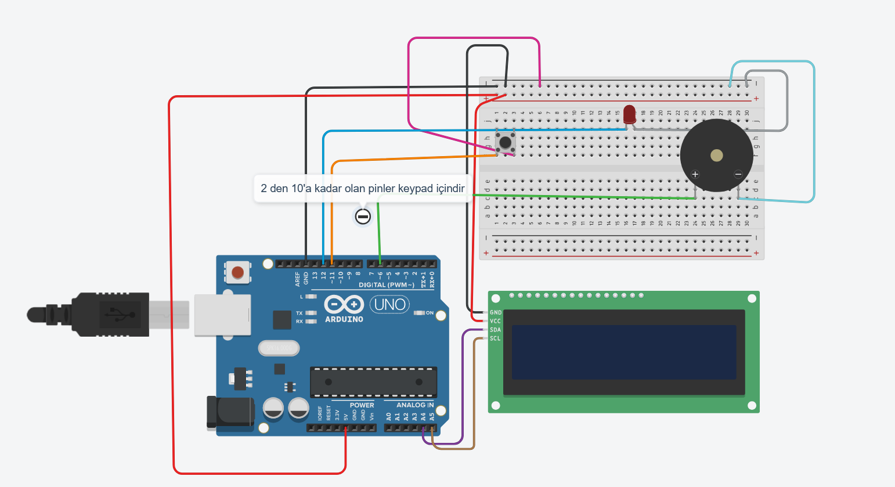

# CSGO2 PROP BOMB (MAKET BOMBA)

**Şifre:** _7355608_

Arduino ile yapılmış, bas-tut imha mekanizmasına sahip CSGO2 BOMB maketi.

**YASAL UYARI:** BU GERÇEK BİR BOMBA VEYA PATLAYICI DÜZENEK DEĞİLDİR; SADECE BİR MAKET VE SANAT OBJESİDİR.

### LİSANS

Bu kaynak kodu ücretsizdir ve MIT Lisansı altında sunulmaktadır! Projenizde kaynak belirtmeniz emeğe saygı açısından değerlidir :)

### BİLGİ

Projenin çalışması için gerekli temel kütüphaneler:
- **Wire** (I2C haberleşmesi için)
- **LiquidCrystal_I2C** (LCD ekran için)
- **Keypad** (Tuş takımı için)

### Kullanılan Bileşenler

- 3x4 Matris Tuş Takımı (Keypad)
- I2C LCD Ekran 16x2
- Buzzer
- 2 Bacaklı Buton (İmha/Defuse için)
- Arduino (Uno, Nano vb.)
- Bağlantı Kabloları

### Çalışma Mantığı

1. **Kurulum:** Cihaz açıldığında doğrudan şifre ekranı gelir. Oyundaki şifreyi (**7355608**) girerek bombayı kurarsınız.
2. **Geri Sayım:** Şifre girildikten sonra bomba aktifleşir ve geri sayım başlar.
3. **İmha (Defuse):** 2 bacaklı butona **basılı tutmanız** gerekir.
   - Ekranda bir ilerleme çubuğu (bar) dolar.
   - Eğer elinizi butondan çekerseniz ilerleme sıfırlanır.
   - Bar **%100** olduğunda bomba imha edilir ve sistem başa döner.
4. **Patlama:** Süre dolduğunda patlama uyarısı verilir ve sistem otomatik olarak başa döner.

### Devre Şeması

### Kurulum Adımları

- Depoyu klonlayın: `git clone https://github.com/yigitefeersoy/CSPROBOMB_TR.git`
- `CSPROBOMB.ino` dosyasını Arduino IDE ile açın.
- Kütüphane yöneticisinden **Wire**, **LiquidCrystal_I2C** ve **Keypad** kütüphanelerinin yüklü olduğunu teyit edin.
- Kartınızı seçip kodu yükleyin.

Eğer buton basılmasına rağmen ID kısmındaki rakamda artış olmuyorsa, butonun bağlı olduğu pin numarasını ve "Pull-up/Pull-down" direnç ayarlarını kod içerisinden kontrol etmeyi unutmayın!
